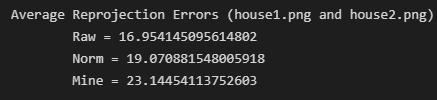
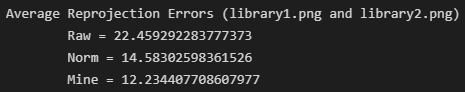
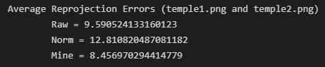
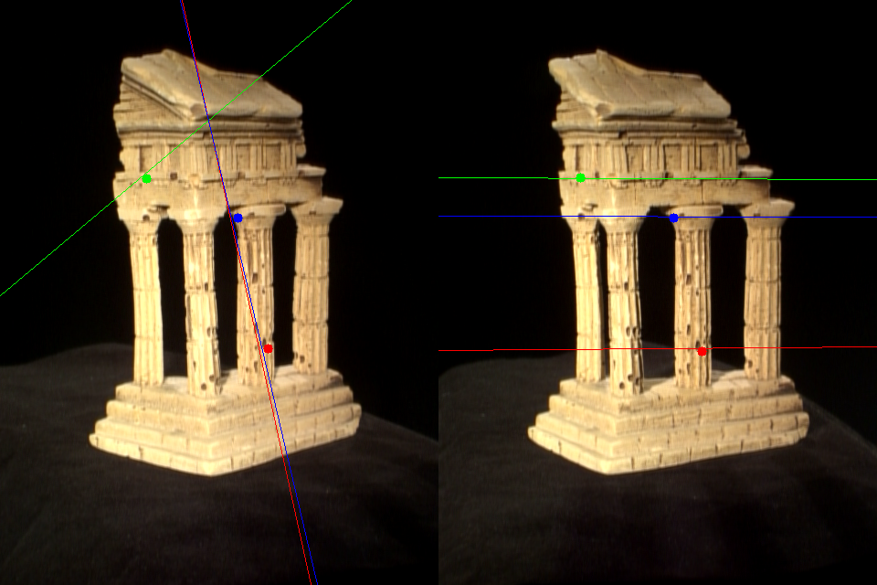

# OpenCV library implementation1
- implement OpenCV functions with Numpy
- from given matching feature points,
    - find fundamental matrix using eight point algorithm
    - find fundamental matrix using eight point algorithm and normalization
    - find fundamental matrix using local minimum(as my algorithm)
        - at first, tried to use RANSAC to find the mat. However, the result was better for local minimum algorithm.
    - drow epipolar line using correspondances
- matching points can be find built in OpenCV functions

## NOTICE
- code in *./data* directory is not implemented by myself.
- images in *./data* are not prepated by myself.

## Fundamental Matrix
- find out 3 x 3 fundamental matrix
- *compute_F_raw* : find the matrix using eight point algorithm
- *compute_F_norm*: find the matrix using eight point algorithm and normalization
- *compute_F_mine(N, M)*
    - randomly select N number of points(N >= 8)
    - compute normalized fundamental matrix using N matches
    - comptue distance between estimated point and real point
    - find matrix that has local minimum distance (minimum distance for whole iteration)

## Epipolar line
- compute epipolar line
    - l, m: matrix [a b c] where line = ax + by + c
    - return 3 x 3 l, m (each has 3 rows each row is [a b c])
- draw circle and line for the image


## File structure
```
|-- fundamental_mat.py
|-- data
    |-- compute_avg_reproj_error.py
    |-- house1.jpg
    |-- house2.jpg
    |-- house_matches.txt
    |-- library1.jpg
    |-- library2.jpg
    |-- library_matches.txt
    |-- temple1.png
    |-- temple2.png
    |-- temple_matches.txt
|-- result
    |-- epipolar_temple_result.png
    |-- house_result.png
    |-- library_result.png
    |-- temple_result.png
```

## Result
<p align=center>
    <br/>
    house result
</p>
<p align=center>
    <br/>
    library result
</p>
<p align=center>
    <br/>
    temple result
</p>
<p align=center>
    <br/>
    epipolar line visualization for temple.png
</p>

## 배운 점
- eight point algorithm을 이용하여 fundamental matrix를 구할 수 있었다.
- N개의 matching point를 뽑아 matrix를 만들어 가장 error가 적은 matrix를 구하는 본인만의 알고리즘을 이용하여 fundamental matrix를 만들 수 있었다. (RANSAC을 이용하여 구현해보았으나 평균적으로 이 방식이 error가 작아 이 방법을 사용하였다.)
- Numpy 사용이 능숙해졌다.

## 한계점
- built in function에 비해 error가 커 구한 matrix로 epipolar line을 구해봤을 때 적절하게 나올 때도 있고 random하게 나올 때도 있다. 더욱 정교한 방식으로 matrix를 구하는 알고리즘을 고안할 필요가 있다.
